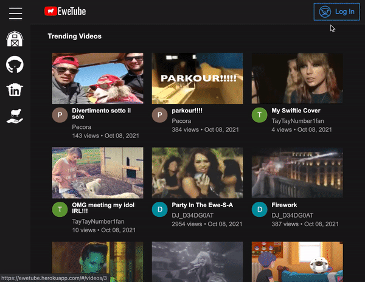

# EweTube

## Background

EweTube is the newest Ovis-themed video streaming site that allows users to share sheep-friendly videos with one another. Users create accounts as well as comment on, like, dislike videos across the site. Users will also be able to view videos liked by themselves or other users. 

## Technologies

:sheep: Ruby on Rails

:sheep: React/Redux

:sheep: PostgreSQL

:sheep: JavaScript / AJAX / JBuilder

:sheep: HTML5 / CSS

## Features

* ### User account creation and login

* ### Post and delete comments on video
