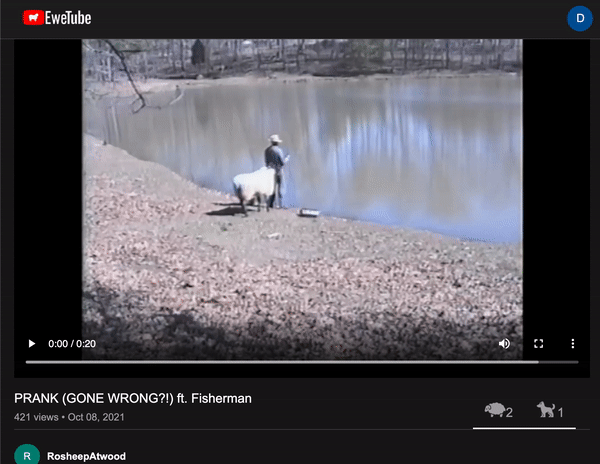
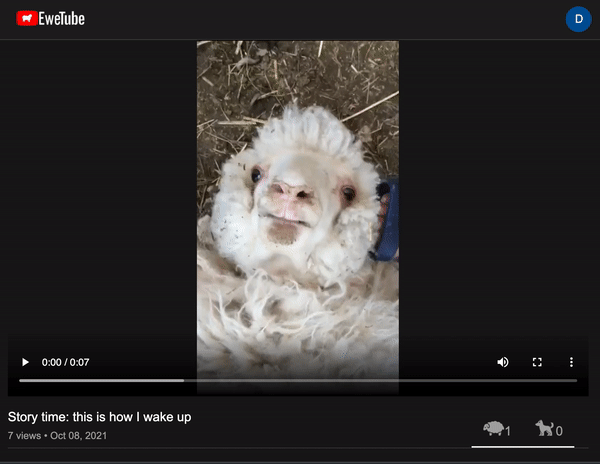

# EweTube


## Background

[EweTube](https://ewetube.herokuapp.com/#/) is the newest Ovis-themed video streaming site that allows users to share sheep-friendly videos with one another. Users create accounts as well as comment on, like, dislike videos across the site. Users will also be able to view videos liked by themselves or other users. 

## Technologies

:sheep: Ruby on Rails

:sheep: React/Redux

:sheep: PostgreSQL

:sheep: JavaScript / AJAX / JBuilder

:sheep: HTML5 / CSS


## Features

* ### User account creation and login


* ### Post and delete comments on videos


* ### Like and dislike videos, liked video is saved on user's page


This feature is possible due to a simple yet effective if-else statement:
```
let likedVideo = [];
if (this.props.videos.length > 0) {
    Object.values(this.props.videos).forEach(video => {
        if (this.props.likes) {
            this.props.likes.forEach(like => {
                if (like.videoId === video.id && like.numLikes === 1) {
                    likedVideo.push(video);
                }
            })
        }
    })
}
```

* ### Video views get updated upon playing


## Upcoming Features

* Search bar
* Video upload

## Special Thanks

* StackOverflow
* Jon Z
* Vern C
* Masa C